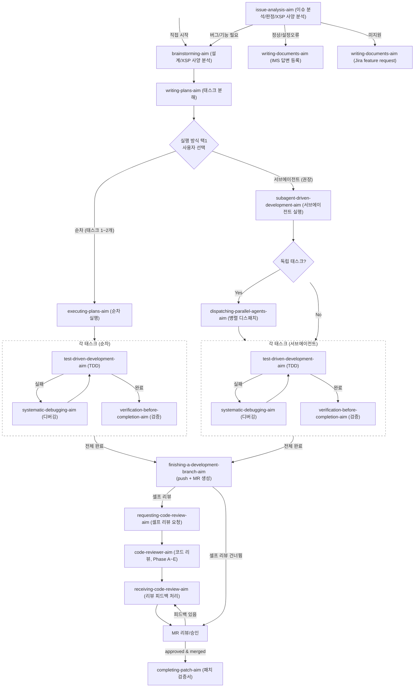

# aim-harness

## 소개

AI 코딩 에이전트(Claude Code, Cursor, Copilot CLI 등)가 코드를 작성할 때, 우리 프로젝트의 규칙과 워크플로우를 따르게 하려면 어떻게 해야 할까요?

aim-harness는 AIM 프로젝트에서 이 문제를 해결하기 위해 구축한 **스킬 체계**입니다. 에이전트에게 "이 프로젝트에서는 이렇게 일해"를 가르치는 규칙과 도구의 묶음입니다.

```
Harness = 스킬(Skills) + 에이전트 정의(Agents) + 프로젝트 규칙(CLAUDE.md) + 자동화(Hooks)
```

- **스킬(Skill)**: "TDD로 개발해", "리뷰 전에 테스트를 먼저 돌려" 같은 작업 지침
- **에이전트(Agent)**: "코드 리뷰어", "테스트 작성자" 같은 전문 역할 정의
- **프로젝트 규칙**: "빌드는 dx make로", "rb_73에 직접 commit 금지" 같은 프로젝트 규칙
- **Hook**: 세션 시작 시 자동으로 규칙을 주입하는 메커니즘

Harness 없이 AI에게 "이 기능 구현해줘"라고 하면, AI는 자기 방식대로 코드를 작성합니다. Harness가 있으면 **우리 프로젝트의 컨벤션, 테스트 정책, Git 전략을 자동으로 따릅니다.**

18개 스킬로 설계부터 MR 완료까지 전체 개발 루프를 커버합니다.

## 주의사항

**이 레포는 AIM 프로젝트에 특화된 harness이다. 그대로 설치하여 사용하는 것이 아니라, 구조와 방법론을 참고하는 프로젝트이다.**

AIM 환경에 종속된 요소가 스킬 전반에 포함되어 있다:
- `dx` (dev_exec.sh) — Docker 컨테이너 경유 빌드/테스트/Git 명령
- `rb_73` 브랜치 정책 — feature branch 전용 commit
- IMS / Jira / GitLab 연동 — 사내 이슈 트래커/코드 리뷰 도구
- GoogleTest + gcov — C 단위 테스트 + 커버리지 80% 정책
- NotebookLM XSP 스펙 참조 — Fujitsu Mainframe 사양서

다른 프로젝트에 적용하려면 위 요소를 자체 환경에 맞게 치환해야 한다.

## 스킬 목록 (18개)

### 개발 루프

| 스킬 | 역할 |
|------|------|
| **brainstorming-aim** | 새 기능/수정/리팩토링의 설계. IMS/Jira/NotebookLM 기반 |
| **writing-plans-aim** | 설계 완료 후 태스크 분해. TDD 체크포인트 포함 |
| **executing-plans-aim** | 계획을 순차 실행. Phase gate 검증 |
| **subagent-driven-development-aim** | fresh 서브에이전트로 태스크별 독립 실행 |
| **dispatching-parallel-agents-aim** | 독립 태스크 병렬 처리 |
| **test-driven-development-aim** | RED-GREEN-REFACTOR. GoogleTest 기반 |
| **systematic-debugging-aim** | 테스트 실패/런타임 에러 시 4단계 근본 원인 분석 |
| **verification-before-completion-aim** | 완료 주장 전 빌드/테스트/커버리지 검증 |
| **using-feature-branches-aim** | feature branch 생성/관리. rb_73 직접 commit 금지 |
| **finishing-a-development-branch-aim** | push + GitLab MR 생성. 4가지 옵션 제시 |

### 코드 리뷰

| 스킬 | 역할 |
|------|------|
| **code-reviewer-aim** | 타인 MR 리뷰. 에이전트 팀 5명, Phase A~I |
| **requesting-code-review-aim** | 내 코드 셀프 리뷰 (code-reviewer-aim --auto) |
| **receiving-code-review-aim** | 리뷰 피드백 수신 후 처리 |

### AIM 전용

| 스킬 | 역할 |
|------|------|
| **issue-analysis-aim** | IMS 이슈 분석 → 4종 판정 (버그/정상/설정오류/미지원) |
| **completing-patch-aim** | MR merge 후 IMS 패치 검증서. QA 관점 |
| **writing-documents-aim** | 문서 작성 통합 가이드. 6개 플랫폼 (Jira/Confluence/IMS/GitLab/메일/markdown) |

### 메타

| 스킬 | 역할 |
|------|------|
| **using-aim-harness** | 스킬 사용 규칙. SessionStart hook으로 자동 주입 |
| **writing-skills-aim** | 스킬 작성 방법론. 스킬에 TDD 적용 |

## 워크플로우 체인



**독립 스킬** (체인 외, 직접 호출):
- **code-reviewer-aim** — 타인 MR 리뷰 (Phase A~I, 에이전트 팀)
- **using-feature-branches-aim** — feature branch 생성/관리
- **writing-documents-aim** — 문서 작성 (각 스킬에서 문서 작성 시 cross-reference)
- **writing-skills-aim** — 스킬 작성/수정

## 디렉토리 구조

```
aim-harness/
├── CLAUDE.md                              # 스킬 라우팅 표 + 사용 규칙
├── settings.json                          # SessionStart hook 설정
├── hooks/
│   └── session-start.sh                   # using-aim-harness 자동 주입
└── skills/
    ├── using-aim-harness/                 # 메타: 스킬 사용 규칙
    ├── brainstorming-aim/                 # 설계
    │   └── spec-document-reviewer-prompt.md
    ├── writing-plans-aim/                 # 태스크 분해
    │   └── plan-document-reviewer-prompt.md
    ├── executing-plans-aim/               # 순차 실행
    ├── subagent-driven-development-aim/   # 서브에이전트 실행
    │   ├── implementer-prompt.md
    │   ├── spec-reviewer-prompt.md
    │   └── code-quality-reviewer-prompt.md
    ├── dispatching-parallel-agents-aim/   # 병렬 처리
    ├── test-driven-development-aim/       # TDD
    │   └── testing-anti-patterns.md
    ├── systematic-debugging-aim/          # 디버깅
    │   ├── condition-based-waiting.md
    │   ├── defense-in-depth.md
    │   ├── root-cause-tracing.md
    │   └── find-polluter.sh
    ├── verification-before-completion-aim/ # 검증
    ├── using-feature-branches-aim/        # 브랜치 관리
    ├── finishing-a-development-branch-aim/ # MR 생성
    ├── requesting-code-review-aim/        # 셀프 리뷰
    ├── receiving-code-review-aim/         # 리뷰 피드백
    ├── code-reviewer-aim/                 # 타인 리뷰 (에이전트 팀)
    │   ├── *-prompt.md (5개)
    │   └── scripts/measure_diff_cov.sh
    ├── issue-analysis-aim/                # IMS 이슈 분석
    ├── completing-patch-aim/              # 패치 검증서
    ├── writing-documents-aim/             # 문서 작성
    │   ├── jira-guide.md
    │   ├── confluence-guide.md
    │   ├── ims-guide.md
    │   ├── gitlab-guide.md
    │   ├── mail-guide.md
    │   └── markdown-guide.md
    └── writing-skills-aim/                # 스킬 작성 방법론
        ├── anthropic-best-practices.md
        ├── testing-skills-with-subagents.md
        └── examples/
```

## 설치 방법 (Claude Code 스킬 일반)

Claude Code에서 스킬을 설치하는 일반적인 방법이다.

### 1. 스킬 파일 배치

```bash
# 프로젝트 루트의 .claude/skills/ 디렉토리에 스킬 폴더를 복사
cp -r skills/<skill-name> <project>/.claude/skills/<skill-name>
```

각 스킬은 `SKILL.md`를 필수로 포함하며, 필요에 따라 prompt 파일, 스크립트 등을 동봉한다.

### 2. CLAUDE.md 설정

프로젝트의 `.claude/CLAUDE.md`에 스킬 사용 규칙과 라우팅 표를 기술한다. Claude Code는 세션 시작 시 이 파일을 자동으로 읽는다.

### 3. SessionStart hook (선택)

`.claude/settings.json`에 hook을 설정하면, 세션 시작/clear/compact 시 특정 스킬의 내용을 자동 주입할 수 있다.

```json
{
  "hooks": {
    "SessionStart": [
      {
        "matcher": "startup|clear|compact",
        "hooks": [
          {
            "type": "command",
            "command": "bash .claude/hooks/session-start.sh"
          }
        ]
      }
    ]
  }
}
```
