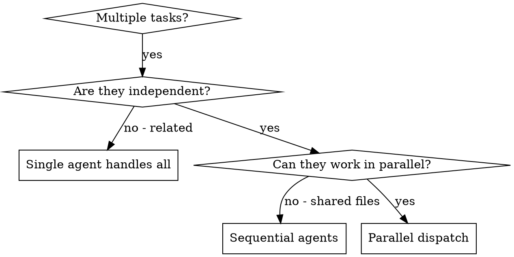

# Dispatching Parallel Agents

## Overview

When you have multiple unrelated problems (different modules, different test files, different bugs), investigating them sequentially wastes time. Each investigation is independent and can happen in parallel.

**Core principle:** Dispatch one agent per independent problem domain. Let them work concurrently.

## When to Use



**Use when:**
- 2+ AIM modules broken independently (e.g., acp + mqn + dcms)
- Multiple test files failing with different root causes
- Each problem can be understood without context from others
- No shared source files between investigations

**Don't use when:**
- Failures are related (fix one might fix others)
- Agents would edit same files
- Need to understand full system state first

## The Pattern

### 1. Identify Independent Domains

Group by AIM module or subsystem:
- Module A (lib/acp): Parser validation failures
- Module B (server/dcms): Connection handling bug
- Module C (lib/mqn): Queue name validation

Each domain is independent — fixing parser doesn't affect queue logic.

### 2. Create Focused Agent Tasks

Each agent gets:
- **Specific scope:** One module or subsystem
- **AIM rules:** `dx` commands, header conventions, TDD
- **Clear goal:** Fix these specific failures
- **Constraints:** Don't change code outside your module
- **Expected output:** Summary of root cause and fix

### 3. Dispatch in Parallel

```
Agent tool (general-purpose):
  description: "Fix lib/acp parser validation"
  prompt: |
    AIM Rules: all commands via dx, TDD cycle, headers per AGENTS.md
    Fix the 2 failing tests in test/unit/gtest/test_acp_parser.cpp:
    1. "RejectsInvalidHeader" - expects AIM_ERR_INVALID but gets AIM_OK
    2. "HandlesEmptyInput" - segfault on NULL input
    Scope: src/lib/acp/ only. Don't change other modules.
    Return: root cause + fix summary.

Agent tool (general-purpose):
  description: "Fix server/dcms connection handling"
  prompt: ...
```

### 4. Review and Integrate

When agents return:
1. Read each summary
2. Verify fixes don't conflict (`dx git diff`)
3. Run full test suite: `dx make gtest`
4. Verify build: `dx make`
5. Commit per module

## Common Mistakes

**Too broad:** "Fix all tests" — agent gets lost
**Specific:** "Fix test_acp_parser.cpp" — focused scope

**No AIM rules:** Agent runs commands directly
**With rules:** Include `dx` requirement in every prompt

**No constraints:** Agent might refactor across modules
**Constrained:** "Scope: src/lib/acp/ only"

## When NOT to Use

- **Related failures:** Fix one might fix others — investigate together first
- **Shared files:** Agents editing same `.c` or `.h` → conflicts
- **Exploratory:** Don't know what's broken yet → systematic-debugging first

## Verification

After agents return:
1. **Review each summary** — understand what changed
2. **Check for conflicts** — did agents edit same files?
3. **Full test suite:** `dx make gtest`
4. **Full build:** `dx make`
5. **Spot check** — agents can make systematic errors

## Integration

**Alternative to:** subagent-driven-development (독립 문제 병렬 처리 시)

**Use case:** 디버깅/조사 병렬 처리. 구현 태스크 병렬 디스패치가 아님.

**Pairs with:**
- **test-driven-development** — 각 에이전트 내에서 TDD
- **systematic-debugging** — 독립 실패 병렬 조사
- **verification-before-completion** — 에이전트 완료 후 통합 검증
