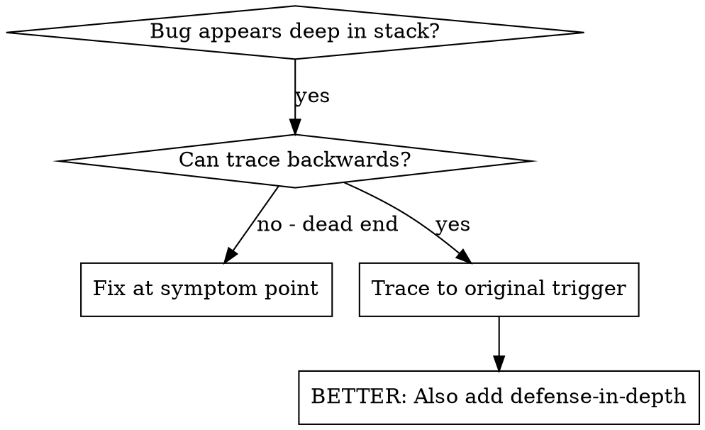
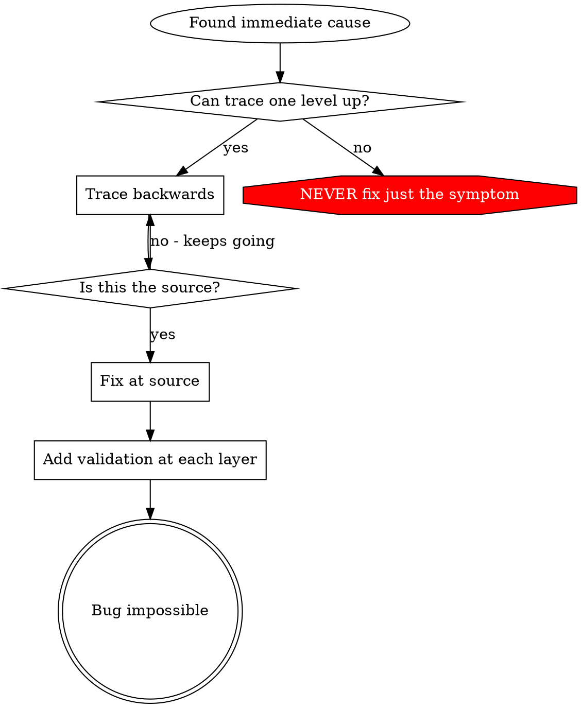

# Root Cause Tracing

## Overview

Bugs often manifest deep in the call stack (wrong Gradle task boundary, module-specific regression reported as full-product failure, generated file written to the wrong runtime path). Your instinct is to fix where the error appears, but that's treating a symptom.

**Core principle:** Trace backward through the call chain until you find the original trigger, then fix at the source.

## When to Use



**Use when:**
- Error happens deep in execution (not at entry point)
- Stack trace shows long call chain
- Unclear where invalid data originated
- Need to find which test/code triggers the problem

## The Tracing Process

### 1. Observe the Symptom
```
Error: OFGW coverage report looks broken, but only :ofgwSrc was actually exercised
```

### 2. Find Immediate Cause
**What code directly causes this?**
```text
JAVA_HOME=/usr/lib/jvm/java-1.8.0-openjdk-amd64 ./gradlew :ofgwSrc:jacocoTestReport --no-daemon
```

### 3. Ask: What Called This?
```text
coverage-review conclusion
  → called by review-context collection
  → fed by build/test evidence
  → fed by actual changed module scope
```

### 4. Keep Tracing Up
**What assumption was passed?**
- `webterminal` and `ofgwAdmin` were treated as covered too
- but the actual command only proved `:ofgwSrc`
- the bug is broad wording, not the Gradle task itself

### 5. Find Original Trigger
**Where did the wrong conclusion come from?**
```text
report text said "OFGW coverage passed"
but the verified command and module scope only covered ofgwSrc
```

## Adding Stack Traces

When you can't trace manually, add instrumentation:

```text
Before recording the conclusion, log:
- changed module(s)
- exact verification command
- exact output artifact
- why the conclusion applies only to those modules
```

**Critical:** Use `console.error()` in tests (not logger - may not show)

**Run and capture:**
```bash
JAVA_HOME=/usr/lib/jvm/java-1.8.0-openjdk-amd64 ./gradlew :ofgwSrc:test --no-daemon
```

**Analyze stack traces:**
- Look for test file names
- Find the line number triggering the call
- Identify the pattern (same test? same parameter?)

## Finding Which Test Causes Pollution

If something appears during tests but you don't know which test or which module boundary is responsible:

Use the helper script `find-polluter.sh` in this directory when test pollution is suspected:

```bash
./find-polluter.sh '.git' 'src/**/*.test.ts'
```

Runs tests one-by-one, stops at first polluter. See script for usage.

## Real Example: Over-Broad Coverage Conclusion

**Symptom:** coverage/result wording implies the whole product changed

**Trace chain:**
1. report says "OFGW validated"
2. actual command only ran `:ofgwSrc:test`
3. no separate evidence exists for `webterminal`
4. no separate evidence exists for `ofgwAdmin`
5. conclusion should have been module-scoped

**Root cause:** module boundary was widened in prose without verification evidence

**Fix:** narrow the conclusion to the module actually covered and make that boundary explicit in docs/review output

**Also added defense-in-depth:**
- Layer 1: bind claims to exact command outputs
- Layer 2: bind claims to explicit module scope
- Layer 3: reject broad wording when only one module was tested
- Layer 4: log concrete evidence before finalizing conclusions

## Key Principle



**NEVER fix just where the error appears.** Trace back to find the original trigger or the first over-broad assumption.

## Stack Trace Tips

**In tests:** Use `console.error()` not logger - logger may be suppressed
**Before operation:** Log before the dangerous operation, not after it fails
**Include context:** Directory, cwd, environment variables, timestamps
**Capture stack:** `new Error().stack` shows complete call chain

## Real-World Impact

Applied to product harness debugging:
- find the exact command, module, and artifact that justified the claim
- narrow conclusions when evidence is module-scoped
- use defense-in-depth so the same overstatement does not recur
