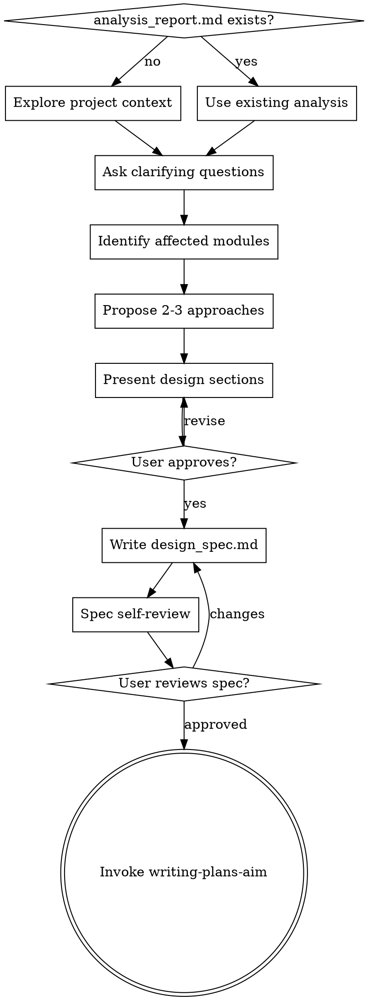

# Brainstorming Ideas Into Designs

Help turn ideas into fully formed designs and specs through natural collaborative dialogue.

Start by understanding the current project context, then ask questions one at a time to refine the idea. Once you understand what you're building, present the design and get user approval.

<HARD-GATE>
Do NOT invoke any implementation skill, write any code, or take any implementation action until you have presented a design and the user has approved it. This applies to EVERY project regardless of perceived simplicity.
</HARD-GATE>

## Anti-Pattern: "This Is Too Simple To Need A Design"

Every project goes through this process. A single-function utility, a config change — all of them. "Simple" projects are where unexamined assumptions cause the most wasted work. The design can be short (a few sentences for truly simple projects), but you MUST present it and get approval.

## Checklist

Complete in order:

1. **Check for analysis_report.md** — if issue-analysis-aim already ran, skip to step 3 using its findings
2. **Explore project context** — check files, IMS/Jira, recent commits, NotebookLM XSP spec (사용자가 불필요하다고 하지 않는 한 필수)
3. **Ask clarifying questions** — one at a time, understand purpose/constraints/success criteria
4. **Identify affected modules** — which AIM modules (lib/svr/tool/util) are impacted
5. **Propose 2-3 approaches** — with trade-offs and your recommendation
6. **Present design** — in sections scaled to complexity, get user approval after each section
7. **Write design doc** — save to `../agent/prompt/<topic>/design_spec.md` and verify
8. **Spec self-review** — check for placeholders, contradictions, ambiguity, scope
9. **User reviews written spec** — ask user to review before proceeding
10. **Transition** — invoke writing-plans-aim to create implementation plan

## Process Flow



**The terminal state is invoking writing-plans-aim.** Do NOT invoke any other implementation skill.

## The Process

**Understanding the idea:**

- Check for `../agent/prompt/<topic>/analysis_report.md` — if issue-analysis-aim already ran, use its findings (symptom, root cause, verdict) instead of re-gathering
- Explore current AIM project state (affected source files, headers, recent commits)
- If IMS/Jira context needed, gather via Chrome automation (IMS) or Mac curl (Jira)
- Reference XSP spec via NotebookLM (사용자가 불필요하다고 하지 않는 한 필수). notebook: `xsp-specification`, **반드시 사용자에게 "XSP 스펙을 참조합니다" 알린 후 참조**. 실패 시 `mcp__notebooklm__re_auth` 또는 `notebooklm.auth-repair`로 재인증 후 재시도. 실패를 이유로 건너뛰지 않는다.
- Ask questions one at a time; prefer multiple choice when possible
- Focus on: purpose, constraints, success criteria, affected interfaces

**Identifying affected modules:**

- Which AIM modules are impacted: `lib`, `svr`, `tool`, `util`
- Which headers change: `include/{MODULE}.h` (external), `{MODULE}_inner.h` (internal), `{SOURCE}.h` (source-local)
- Which errcode/msgcode files need updates
- Impact on existing tests

**Exploring approaches:**

- Propose 2-3 different approaches with trade-offs
- Lead with your recommendation and explain why
- Consider: backward compatibility, performance, testing complexity

**Presenting the design:**

- Scale each section to its complexity
- Ask after each section whether it looks right
- Cover: architecture, affected modules, interface changes, error handling, testing strategy
- Be ready to go back and clarify

**Working in existing codebase:**

- Explore current AIM structure before proposing changes. Follow existing patterns.
- Where existing code has problems that affect the work, include targeted improvements as part of the design
- Don't propose unrelated refactoring. Stay focused.

## After the Design

**Documentation:**

Save validated design to `../agent/prompt/<topic>/design_spec.md`

```markdown
# Design Spec: <topic>

## Background
<IMS/Jira reference, problem statement>

## AS-IS
<current behavior, affected code paths>

## TO-BE
<proposed behavior, approach>

## Affected Modules
| Module | Type | Changes |
|--------|------|---------|
| ... | lib/svr/tool/util | ... |

## Interface Changes
<header changes, new/modified functions>

## Error Handling
<new errcode/msgcode if needed>

## Testing Strategy
<gtest plan, coverage targets>

## Risks / Open Questions
```

**Spec Self-Review:**

1. **Placeholder scan:** Any "TBD", "TODO", incomplete sections? Fix them.
2. **Internal consistency:** Do sections contradict each other?
3. **Scope check:** Focused enough for a single implementation plan?
4. **Ambiguity check:** Could any requirement be interpreted two ways?

**User Review Gate:**

> "Spec written to `../agent/prompt/<topic>/design_spec.md`. Please review and let me know if you want changes before we proceed to planning."

Wait for user approval. Only then invoke writing-plans-aim.

## Key Principles

- **One question at a time** — don't overwhelm
- **Multiple choice preferred** — easier to answer
- **YAGNI ruthlessly** — remove unnecessary features
- **Explore alternatives** — always 2-3 approaches before settling
- **Incremental validation** — present, get approval, move on
- **Reuse analysis** — if issue-analysis-aim ran, don't re-gather

## Red Flags

- Writing code before design approval
- Skipping to writing-plans-aim without user approving spec
- Re-gathering IMS/Jira info when analysis_report.md exists
- Proposing only one approach without alternatives
- Design doc with "TBD" sections
