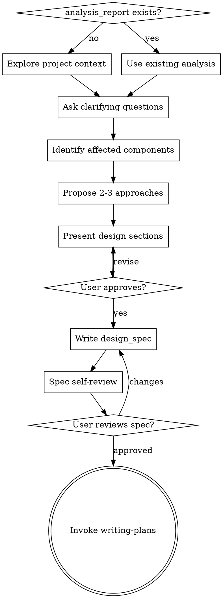

# Brainstorming Ideas Into Designs

Help turn ideas into fully formed designs and specs through natural collaborative dialogue.

Start by understanding the current project context, then ask questions one at a time to refine the idea. Once you understand what you're building, present the design and get user approval.

<HARD-GATE>
Do NOT invoke any implementation skill, write any code, or take any implementation action until you have presented a design and the user has approved it. This applies to EVERY project regardless of perceived simplicity.
</HARD-GATE>

## Anti-Pattern: "This Is Too Simple To Need A Design"

Every project goes through this process. A single-function utility, a config change — all of them. "Simple" projects are where unexamined assumptions cause the most wasted work. The design can be short (a few sentences for truly simple projects), but you MUST present it and get approval.

## Checklist

Complete in order:

1. **Check for prior analysis** — if an existing analysis or investigation doc exists, reuse it instead of restarting discovery
2. **Explore project context** — check files, recent commits, architecture boundaries, and any relevant external references
3. **Ask clarifying questions** — one at a time, understand purpose/constraints/success criteria
4. **Identify affected components** — which modules, services, APIs, schemas, or UX surfaces are impacted
5. **Propose 2-3 approaches** — with trade-offs and your recommendation
6. **Present design** — in sections scaled to complexity, get user approval after each section
7. **Write design doc** — save the `design_spec` artifact in the current topic artifact workspace and verify
8. **Spec self-review** — check for placeholders, contradictions, ambiguity, scope
9. **User reviews written spec** — ask user to review before proceeding
10. **Transition** — invoke writing-plans to create implementation plan

## Process Flow



**The terminal state is invoking writing-plans.** Do NOT invoke any other implementation skill.

## The Process

**Understanding the idea:**

- Check for an existing `analysis_report` artifact or equivalent prior notes — if earlier analysis already exists, use its findings instead of re-gathering
- Explore current project state (affected files, interfaces, recent commits, existing patterns)
- If external systems, tickets, specs, or reference docs matter, gather only the inputs needed for design
- Ask questions one at a time; prefer multiple choice when possible
- Focus on: purpose, constraints, success criteria, affected interfaces

**Identifying affected components:**

- Which modules, packages, services, database objects, APIs, or UI surfaces are impacted
- Which public interfaces or contracts change
- Which config, schema, validation, or error-handling paths need updates
- Impact on existing tests

**Exploring approaches:**

- Propose 2-3 different approaches with trade-offs
- Lead with your recommendation and explain why
- Consider: backward compatibility, performance, testing complexity

**Presenting the design:**

- Scale each section to its complexity
- Ask after each section whether it looks right
- Cover: architecture, affected components, interface changes, error handling, testing strategy
- Be ready to go back and clarify

**Working in existing codebase:**

- Explore current project structure before proposing changes. Follow existing patterns.
- Where existing code has problems that affect the work, include targeted improvements as part of the design
- Don't propose unrelated refactoring. Stay focused.

## After the Design

**Documentation:**

Save the validated `design_spec` artifact in the current topic artifact workspace. The current runtime may map this to a concrete path such as `design_spec.md`.

```markdown
# Design Spec: <topic>

## Background
<problem statement, prior analysis, relevant references>

## AS-IS
<current behavior, affected code paths>

## TO-BE
<proposed behavior, approach>

## Affected Components
| Component | Type | Changes |
|-----------|------|---------|
| ... | module/service/api/ui/schema | ... |

## Interface Changes
<API, schema, config, function, or UX changes>

## Error Handling
<validation, fallback, and failure behavior>

## Testing Strategy
<unit/integration/manual verification plan>

## Risks / Open Questions
```

**Spec Self-Review:**

1. **Placeholder scan:** Any "TBD", "TODO", incomplete sections? Fix them.
2. **Internal consistency:** Do sections contradict each other?
3. **Scope check:** Focused enough for a single implementation plan?
4. **Ambiguity check:** Could any requirement be interpreted two ways?

**User Review Gate:**

> "The `design_spec` artifact is written in the current topic workspace. Please review it and let me know if you want changes before we proceed to planning."

Wait for user approval. Only then invoke writing-plans.

## Key Principles

- **One question at a time** — don't overwhelm
- **Multiple choice preferred** — easier to answer
- **YAGNI ruthlessly** — remove unnecessary features
- **Explore alternatives** — always 2-3 approaches before settling
- **Incremental validation** — present, get approval, move on
- **Reuse prior analysis** — if a valid investigation already exists, don't re-gather

## Red Flags

- Writing code before design approval
- Skipping to writing-plans without user approving spec
- Re-gathering external context when usable prior analysis already exists
- Proposing only one approach without alternatives
- Design doc with "TBD" sections

## Integration

**Called by:**
- product-specific analysis under `product-specific/skills/issue-analysis-base` — when prior analysis already exists and should feed design
- direct user entry

**Feeds into:**
- **writing-plans** — after design approval (terminal state)
