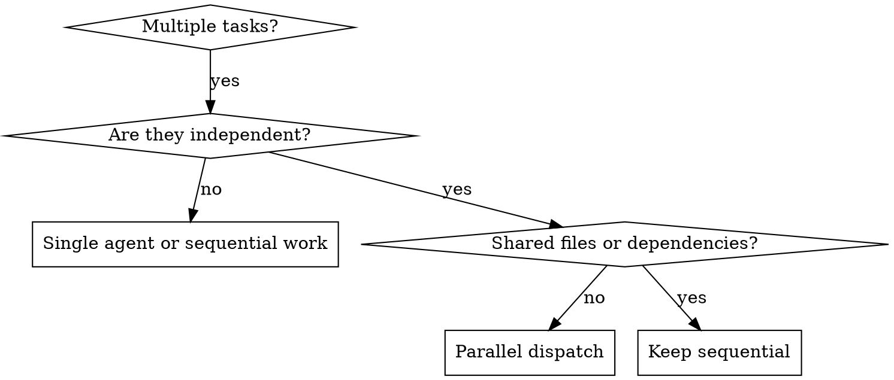

# Dispatching Parallel Agents

## Overview

When multiple independent problems exist, solving them sequentially wastes time. Parallel dispatch helps only when the tasks are truly independent.

**Core principle:** One agent per independent problem domain, with clear scope and no overlapping write ownership.

## When to Use

Use when:
- 2+ failures have different root causes
- 2+ tasks touch disjoint files or modules
- Each task can be understood without waiting on the others
- Parallel work will not create merge or design conflicts

Do not use when:
- Failures may share one root cause
- Agents would edit the same files
- You still need a single-system understanding first
- One task's result determines the shape of another

## The Pattern

### 1. Identify Independent Domains

Split work by:
- File ownership
- Module or subsystem
- Distinct failing tests
- Distinct bug reports
- Separate integration boundaries

Bad split:
- Two agents editing the same API and its call sites at once

Good split:
- One agent handles parser validation
- One agent handles session timeout logic
- One agent handles a separate UI rendering regression

### 2. Create Focused Agent Tasks

Each agent should get:
- One clear scope
- Exact files or directories it may edit
- One goal
- Known constraints
- Required output format

Good task framing:
- "Investigate and fix the failing parser tests in `src/parser/` and `tests/parser/` only."
- "Trace and fix the timeout regression in `src/session/` without editing auth code."

Bad task framing:
- "Fix everything."
- "Look around and see what seems wrong."

### 3. Dispatch in Parallel

For each agent:
- State ownership clearly
- State non-ownership clearly
- Include only relevant context
- Tell the agent not to expand scope without reporting back

Parallel dispatch is about bounded scope, not raw concurrency.

### 4. Review and Integrate

When agents return:
1. Read each summary
2. Check for overlapping edits or design conflicts
3. Review whether the combined changes still make sense together
4. Run the appropriate integrated verification
5. Accept or send back specific follow-up work

## Common Mistakes

**Too broad:** agents wander and duplicate work  
**Better:** one bounded failure domain per agent

**Hidden overlap:** tasks looked separate but write the same shared contract  
**Better:** split by actual write ownership, not symptoms only

**No integration pass:** each agent is locally correct but globally inconsistent  
**Better:** always review combined behavior after parallel work

## When Not to Use

- Related failures where one fix may collapse multiple symptoms
- Shared write scope
- Tasks blocked on one architectural decision
- Early exploration when you do not yet know how to partition the work

In those cases, debug or design first, then dispatch.

## Verification

After agents return:
1. Review each agent's summary
2. Check for conflicting file edits
3. Run integrated verification for the combined patch set
4. Spot-check that agents stayed within scope

Parallel completion is not complete until integration verification passes.

## Integration

**Alternative to:** `subagent-driven-development-base` when the problem is better partitioned by independent domains than by sequential plan tasks

**Pairs with:**
- **test-driven-development-base** — each agent should preserve behavior with tests
- **systematic-debugging-base** — for independent investigation tracks
- **verification-before-completion-base** — integrated verification after parallel work
