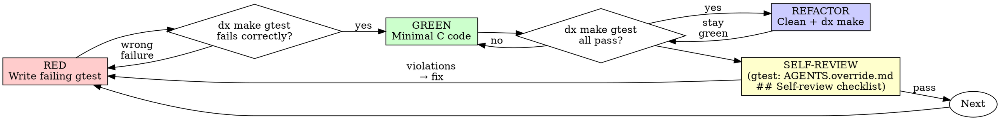

# Test-Driven Development (TDD)

## Overview

Write the test first. Watch it fail. Write minimal code to pass.

**Core principle:** If you didn't watch the test fail, you don't know if it tests the right thing.

**Violating the letter of the rules is violating the spirit of the rules.**

## SSoT & Read 의무

| 상황 | SSoT | Read 의무 | 비고 |
|---|---|:---:|---|
| 신규 `gtest_*.cpp` 작성 또는 기존 파일에 TEST_F 추가 | `aim/test/unit/gtest/AGENTS.override.md` | ✅ | canonical template, 네이밍, 섹션 마커, 주석 전체 |
| gtest 작성 후 commit 직전 (self-review gate) | 동 파일의 `## Self-review checklist (적신호)` 섹션 | ✅ | 위반 시 DONE_WITH_CONCERNS에 `[Check Fail]` 기재 |
| AIM-Specific Testing Patterns (아래) | (본 SKILL.md 본문) | — | TDD 방법론과 직접 연결된 패턴만 유지 |

## When to Use

**Always:**
- New features
- Bug fixes
- Refactoring
- Behavior changes

**Exceptions (ask user):**
- Throwaway prototypes
- Generated code (lex/yacc output)
- Configuration files

Thinking "skip TDD just this once"? Stop. That's rationalization.

## The Iron Law

```
NO PRODUCTION CODE WITHOUT A FAILING TEST FIRST
```

Write code before the test? Delete it. Start over.

**No exceptions:**
- Don't keep it as "reference"
- Don't "adapt" it while writing tests
- Don't look at it
- Delete means delete

Implement fresh from tests. Period.

## Red-Green-Refactor



### RED - Write Failing Test

Write one minimal GoogleTest showing what should happen.

<Good>
```cpp
TEST(AimRetry, RetriesFailedOperations3Times) {
    int attempts = 0;
    int rc = aim_retry_operation(&attempts, 3);

    EXPECT_EQ(rc, AIM_OK);
    EXPECT_EQ(attempts, 3);
}
```
Clear name, tests real behavior, one thing
</Good>

<Bad>
```cpp
TEST(AimRetry, TestRetry) {
    // just calls the function and checks return
    EXPECT_EQ(aim_retry_operation(NULL, 0), 0);
}
```
Vague name, doesn't verify actual retry count
</Bad>

**Requirements:**
- One behavior per test
- Clear descriptive name (TestSuite, TestName)
- Real code (avoid mocking unless unavoidable)

### Verify RED - Watch It Fail

**MANDATORY. Never skip.**

**빌드 스코프 최소화 (시간 절약):** RED 단계에서는 **방금 추가한 테스트 바이너리만** 빌드/실행한다. 전체 `dx make gtest`는 금지 — 불필요한 전체 재컴파일로 빌드 4회가 누적되어 태스크당 20분 이상 낭비된다.

```bash
# 방금 추가한 테스트 바이너리만 빌드/실행
# (`make`는 install 안 하므로 tmdown 선행 불필요)
dx bash -c "cd /root/ofsrc/aim/test/unit/gtest/src/<zone>/<module> && make -f Makefile_<target> && ./gtest_<module>_<target>"
```

Confirm:
- Test fails (not build errors)
- Failure message is expected
- Fails because feature missing (not typos or link errors)

**Test passes?** You're testing existing behavior. Fix test.

**Build error?** Fix build error first, re-run until it fails correctly.

### GREEN - Minimal Code

Write simplest C code to pass the test.

<Good>
```c
int aim_retry_operation(int *attempts, int max_retries) {
    for (int i = 0; i < max_retries; i++) {
        (*attempts)++;
        int rc = _do_operation();
        if (rc == AIM_OK) return AIM_OK;
    }
    return AIM_ERR_RETRY_EXHAUSTED;
}
```
Just enough to pass
</Good>

<Bad>
```c
int aim_retry_operation(int *attempts, int max_retries,
                        int backoff_ms, int (*callback)(int),
                        aim_retry_opts_t *opts) {
    // YAGNI - over-engineered
}
```
Over-engineered
</Bad>

Don't add features, refactor other code, or "improve" beyond the test.

### Verify GREEN - Watch It Pass

**MANDATORY.**

**빌드 스코프 최소화:** 태스크 중간에는 **수정한 모듈의 테스트만** 실행한다. 전체 `dx make gtest`(전 모듈 회귀)는 **모든 태스크 완료 후 1회만** 수행 (verification-before-completion-aim에서 처리).

```bash
# 해당 모듈 테스트만 재빌드/실행 (tmdown 불필요)
dx bash -c "cd /root/ofsrc/aim/test/unit/gtest/src/<zone>/<module> && make && ./gtest_<module>_<target>"
```

Confirm:
- Test passes
- Modified module's other tests still pass
- No warnings or errors in output

Then verify production build:
```bash
dx make
```

**Test fails?** Fix code, not test.

**Build fails?** Fix now.

### REFACTOR - Clean Up

After green only:
- Remove duplication
- Improve names
- Extract helpers
- Run `clang-format -i` on changed files

Keep tests green. Don't add behavior.

```bash
dx make gtest   # still green after refactor
dx make         # production build still clean
```

### Repeat

Next failing test for next feature.

## AIM-Specific Testing Patterns

### Static Function Testing

Static functions that need testing must be promoted:

1. Remove `static` keyword
2. Keep underscore prefix (`_helper_func`)
3. Declare in `{SOURCE FILE}.h` with block comment:

```c
/******************************************************************************
 *                          Static Function                                   *
 *Although it is a static function, it is declared as follows for unit testing*
 ******************************************************************************/
int _aim_parse_header(const char *buf, aim_header_t *hdr);
```

4. Remove forward declaration from `.c` file
5. Include `{SOURCE FILE}.h` in the `.c` file

### Test File Organization

소스 트리와 테스트 트리가 1:1 대응한다:

```
src/<zone>/<module>/<source>.c
  → test/unit/gtest/src/<zone>/<module>/gtest_<module>_<function>.cpp
```

예시:
```
src/lib/acp/acp_parser.c
  → test/unit/gtest/src/lib/acp/gtest_acp_acp_parser.cpp
```

- 네이밍: `gtest_<module>_<function>.cpp` — 함수 1개당 cpp 1개 권장
- 예외: 함수 간 결합이 강한 경우(연속 호출/동일 워크플로우)는 1개 cpp 허용
- 디렉토리: `test/unit/gtest/src/<zone>/<module>/`

### Canonical Test Format & Mocking Rules

canonical template, 파일/Mock/Fixture 네이밍, 섹션 마커, Suite/TEST_F 주석, TEST body 구조 주석, `HP_*`/`E_*` prefix, Include 순서, `extern "C"` 규칙, Mock/Makefile 규칙은 **governance SSoT에 있다**:

→ `aim/test/unit/gtest/AGENTS.override.md`

**Read 의무**: 신규 `gtest_*.cpp` 작성, 또는 기존 파일에 TEST_F 추가 전 필수 (상세 규칙을 SKILL.md abbreviated summary로 대체 금지).

**Self-review gate**: commit 직전 동 SSoT의 `## Self-review checklist (적신호)` 통과 확인. 위반 시 재작성 또는 DONE_WITH_CONCERNS 리포트에 `[Check Fail] <항목>: <상황>` 기재.

**레거시 파일 주의**: 기존 파일이 canonical 확정(2026-04-14) 이전 레거시일 수 있다. 레거시 스타일 답습 금지 — 새 TEST_F부터 canonical 준수.

### Coverage Requirement

커버리지 측정 시 **반드시 `make clean && make gtest`** 실행. `make gtest-run`만 하면 소스 `.o`가 커버리지 플래그 없이 빌드된 캐시가 남아 `.gcda`가 생성되지 않음 (커버리지 0%).

**`make`는 install 안 하므로 `tmdown` 선행 불필요**. 이전엔 `make`가 `cp aimdcms` 등 install까지 수행하여 실행 중 서버 바이너리와 `Text file busy` 충돌이 발생했으나, install이 분리된 이후로 `make clean && make gtest`는 install을 트리거하지 않는다. `make install`을 별도 수행하는 경우에만 `dx tmdown -y` 선행.

```bash
dx bash -c "cd /root/ofsrc/aim && make clean && make gtest"
dx bash -c "cd /root/ofsrc/aim && bash .claude/skills/code-reviewer-aim/scripts/measure_diff_cov.sh"
```

**미커버 라인 식별:** `gcov`를 직접 `grep`/`awk`로 파싱하지 말 것. gcov 출력이 메타데이터 5줄만 나오는 재현성 있는 현상이 관찰됨. `measure_diff_cov.sh` 출력 + `dx git diff --unified=0 <base>..HEAD` 조합으로 추가 라인을 직접 확인한다.

mock 바이너리가 있는 경우 빌드하지 않고 **실행만** 추가 (빌드하면 gcda 리셋):
```bash
dx bash -c "cd /root/ofsrc/aim/test/unit/gtest/src/<zone>/<module> && ./gtest_<module>_<target>"
```

**80% added-code line coverage required.** If below, write more tests.

## Good Tests

| Quality | Good | Bad |
|---------|------|-----|
| **Minimal** | One thing. "and" in name? Split it. | `TEST(Aim, ValidatesEmailAndDomainAndWhitespace)` |
| **Clear** | Name describes behavior | `TEST(Aim, Test1)` |
| **Shows intent** | Demonstrates desired API | Obscures what code should do |

## Why Order Matters

**"I'll write tests after to verify it works"**

Tests written after code pass immediately. Passing immediately proves nothing:
- Might test wrong thing
- Might test implementation, not behavior
- Might miss edge cases you forgot
- You never saw it catch the bug

**"I already manually tested all the edge cases"**

Manual testing is ad-hoc:
- No record of what you tested
- Can't re-run when code changes
- Easy to forget cases under pressure
- "It worked when I tried it" != comprehensive

**"Deleting X hours of work is wasteful"**

Sunk cost fallacy. The time is already gone. Working code without real tests is technical debt.

**"TDD is dogmatic, being pragmatic means adapting"**

TDD IS pragmatic: finds bugs before commit, prevents regressions, documents behavior, enables refactoring. "Pragmatic" shortcuts = debugging in production = slower.

## Common Rationalizations

| Excuse | Reality |
|--------|---------|
| "Too simple to test" | Simple code breaks. gtest takes 30 seconds. |
| "I'll test after" | Tests passing immediately prove nothing. |
| "Tests after achieve same goals" | Tests-after = "what does this do?" Tests-first = "what should this do?" |
| "Already manually tested" | Ad-hoc != systematic. No record, can't re-run. |
| "Deleting X hours is wasteful" | Sunk cost fallacy. Keeping unverified code is technical debt. |
| "Keep as reference, write tests first" | You'll adapt it. That's testing after. Delete means delete. |
| "Need to explore first" | Fine. Throw away exploration, start with TDD. |
| "Test hard = design unclear" | Listen to test. Hard to test = hard to use. |
| "Static function can't be tested" | Promote to header. See AIM-Specific Testing Patterns. |
| "Existing code has no tests" | You're improving it. Add tests for your changes. |

## Red Flags - STOP and Start Over

- Code before test
- Test after implementation
- Test passes immediately
- Can't explain why test failed
- Tests added "later"
- Rationalizing "just this once"
- "I already manually tested it"
- "Tests after achieve the same purpose"
- "It's about spirit not ritual"
- "Keep as reference" or "adapt existing code"
- "Already spent X hours, deleting is wasteful"
- "Static function, can't test it" (promote it!)
- "This is different because..."

**All of these mean: Delete code. Start over with TDD.**

## Example: Bug Fix (C/GoogleTest)

**Bug:** Empty message queue name accepted

**RED**
```cpp
TEST(AimMqn, RejectsEmptyQueueName) {
    int rc = aim_mqn_validate("");
    EXPECT_EQ(rc, AIM_ERR_INVALID_PARAM);
}
```

**Verify RED**
```bash
$ dx make gtest
[ FAILED ] AimMqn.RejectsEmptyQueueName
  Expected: AIM_ERR_INVALID_PARAM
  Actual: AIM_OK
```

**GREEN**
```c
int aim_mqn_validate(const char *mqn) {
    if (mqn == NULL || mqn[0] == '\0') {
        return AIM_ERR_INVALID_PARAM;
    }
    // existing validation...
}
```

**Verify GREEN**
```bash
$ dx make gtest
[  PASSED  ] AimMqn.RejectsEmptyQueueName
$ dx make
Build complete.
```

**REFACTOR**
Extract validation for reuse if needed. `clang-format -i` on changed files.

## Verification Checklist

Before marking work complete:

- [ ] Every new function has a gtest
- [ ] Watched each test fail before implementing
- [ ] Each test failed for expected reason (feature missing, not build error)
- [ ] Wrote minimal code to pass each test
- [ ] All tests pass (`dx make gtest`)
- [ ] Production build clean (`dx make`)
- [ ] Coverage >= 80% on added code
- [ ] `clang-format -i` applied

Can't check all boxes? You skipped TDD. Start over.

## When Stuck

| Problem | Solution |
|---------|----------|
| Don't know how to test | Write wished-for API. Write assertion first. |
| Test too complicated | Design too complicated. Simplify interface. |
| External dependency | Use link-time substitution or wrapper function. |
| Test setup huge | Extract test fixtures. Still complex? Simplify design. |

## Debugging Integration

Bug found? Write failing test reproducing it. Follow TDD cycle. Test proves fix and prevents regression.

Never fix bugs without a test.

## Testing Anti-Patterns

When adding test utilities or isolating dependencies, read @testing-anti-patterns.md to avoid common pitfalls:
- Testing stub behavior instead of real behavior
- Adding test-only methods to production code
- Over-isolating without understanding dependencies

## Final Rule

```
Production code -> test exists and failed first
Otherwise -> not TDD
```

No exceptions without user's explicit permission.

## Integration

**Called by:**
- **executing-plans-aim** — 각 태스크 실행 시
- **subagent-driven-development-aim** — implementer 서브에이전트 내부
- **systematic-debugging-aim** Phase 4 — 수정 검증 테스트 작성 시
- **receiving-code-review-aim** — 리뷰 피드백 기반 로직 수정 시
