# Test-Driven Development

## Overview

Write the test first. Watch it fail for the right reason. Write the minimum code to pass. Then refactor without changing behavior.

**Core principle:** If you did not see the test fail before implementation, you do not know whether the test actually protects the behavior you care about.

## When to Use

**Always:**
- New features
- Bug fixes
- Refactoring with behavior protection
- Behavior changes

**Exceptions (ask the user first):**
- Throwaway prototypes
- Generated code
- Pure configuration changes

## The Iron Law

```text
NO PRODUCTION CODE WITHOUT A FAILING TEST FIRST
```

If you wrote production code before the test, discard it and restart from the test.

## Red-Green-Refactor

```dot
digraph tdd_cycle {
    rankdir=LR;
    red [label="RED\nWrite failing test", shape=box, style=filled, fillcolor="#ffcccc"];
    verify_red [label="Fails for the\nright reason?", shape=diamond];
    green [label="GREEN\nWrite minimal code", shape=box, style=filled, fillcolor="#ccffcc"];
    verify_green [label="Targeted tests\npass?", shape=diamond];
    refactor [label="REFACTOR\nClean up safely", shape=box, style=filled, fillcolor="#ccccff"];
    verify_refactor [label="Still green?", shape=diamond];
    next [label="Next behavior", shape=ellipse];

    red -> verify_red;
    verify_red -> green [label="yes"];
    verify_red -> red [label="no"];
    green -> verify_green;
    verify_green -> refactor [label="yes"];
    verify_green -> green [label="no"];
    refactor -> verify_refactor;
    verify_refactor -> next [label="yes"];
    verify_refactor -> refactor [label="fix"];
}
```



## RED - Write the Failing Test

Write one small test that demonstrates the missing behavior.

<Good>

```ts
it("rejects empty queue names", () => {
  expect(validateQueueName("")).toEqual({ ok: false, reason: "empty-name" });
});
```

Clear behavior, one expectation, obvious failure target.

</Good>

<Bad>

```ts
it("test queue logic", () => {
  expect(validateQueueName("")).toBeDefined();
});
```

Vague name, weak assertion, unclear intent.

</Bad>

**Requirements:**
- One behavior per test
- Clear descriptive name
- Assertions that prove behavior, not just execution
- Prefer real behavior over excessive mocking

## Verify RED - Watch It Fail

**Mandatory. Never skip.**

Run the narrowest test command that exercises the new test.

Confirm:
- The test fails
- It fails for the expected reason
- It fails because the behavior is missing, not because of typos, wiring mistakes, or broken setup

**If the test passes immediately:** you are testing existing behavior or the wrong thing. Fix the test.

**If the failure is unrelated:** fix the test/setup until the failure proves the intended gap.

## GREEN - Write the Minimum Code

Write the smallest production change that makes the failing test pass.

<Good>

```ts
export function validateQueueName(name: string) {
  if (!name) return { ok: false, reason: "empty-name" };
  return { ok: true };
}
```

Just enough to satisfy the test.

</Good>

<Bad>

```ts
export function validateQueueName(
  name: string,
  options?: ValidationOptions,
  reporter?: Reporter,
  hooks?: HookSet
) {
  // many extra features not required by the failing test
}
```

Over-engineered and not test-driven.

</Bad>

Do not add speculative features, unrelated cleanup, or convenience abstractions during GREEN.

## Verify GREEN - Watch It Pass

Run:
- The targeted test you just added
- Nearby tests that protect the same component or behavior
- The smallest broader verification command that gives confidence the task is still valid

Confirm:
- The new test passes
- Related tests stay green
- No new warnings or obvious regressions appear

If GREEN fails, fix the production code, not the test intent.

## REFACTOR - Clean Up Safely

Only refactor after GREEN.

Allowed refactors:
- Remove duplication
- Improve names
- Extract helpers
- Simplify control flow
- Clarify test fixtures

After each meaningful refactor:
- Re-run the targeted test
- Re-run nearby tests as needed

Refactoring must not change behavior.

## Repeat

Move to the next missing behavior by writing the next failing test.

Do not batch multiple new behaviors behind one oversized implementation step.

## Test Scope Rules

- Prefer the narrowest test that proves the behavior
- Prefer targeted verification during task execution
- Defer full regression suites to the repository's completion/verification gate unless the change is high-risk
- Keep feedback loops short

## Good Test Qualities

| Quality | Good | Bad |
|---------|------|-----|
| Minimal | One behavior per test | Multiple unrelated expectations |
| Clear | Name states behavior | Generic names like `Test1` |
| Behavioral | Asserts outcomes and contracts | Asserts implementation trivia |
| Repeatable | Deterministic input/output | Time/order/environment fragile |

## Why Order Matters

**"I'll write tests after."**

Tests written after code often validate what you already built, not what was actually required.

**"I manually tested it already."**

Manual testing is not a durable regression safety net.

**"This change is too small for TDD."**

Small changes are exactly where unchecked assumptions slip through.

## Common Rationalizations

| Excuse | Reality |
|--------|---------|
| "Too simple to test" | Simple code still breaks. |
| "I'll test after" | Tests-after do not prove the design was driven by behavior. |
| "I already explored the solution" | Exploration is fine, but implementation still starts from a failing test. |
| "This bug is obvious" | Reproducible bugs still need regression tests. |
| "The test is hard to write" | Hard-to-test code often signals design problems. |
| "Existing code has no tests" | That is a reason to improve the area, not copy the weakness. |

## Red Flags - Stop and Restart

- Production code before test
- Test added after implementation
- Test passes immediately
- You cannot explain why the test failed
- You changed the test to match broken behavior without approval
- You are using "just this once" reasoning

All of these mean the TDD loop has been broken.

## Verification Checklist

Before claiming the task is done:

- [ ] Every behavior change has a protecting test
- [ ] Each test was seen failing before implementation
- [ ] Each failure was for the expected reason
- [ ] Minimal code was written to pass
- [ ] Targeted tests are green
- [ ] Broader task-level verification was run
- [ ] Refactors were done only after GREEN

If you cannot check these boxes honestly, you did not complete the TDD loop.

## When Stuck

| Problem | Response |
|---------|----------|
| Don't know how to test | Write the desired API or observable behavior first. |
| Test setup is huge | Simplify the design or extract fixtures/helpers. |
| External dependency is hard to control | Add a seam, wrapper, fake, or controlled test double. |
| The failing test is unclear | Tighten the assertion until the behavior gap is explicit. |

## Debugging Integration

When fixing a bug:

1. Reproduce it with a failing test
2. Make the test pass with minimal code
3. Keep the test as regression protection

Never treat bug fixing as separate from TDD.

## Testing Anti-Patterns

When adding test utilities or isolating dependencies, read `testing-anti-patterns.md` to avoid:
- Testing the stub instead of behavior
- Adding test-only escape hatches to production code
- Over-isolating without understanding real dependencies

## Final Rule

```text
Production code -> test existed and failed first
Otherwise -> not TDD
```

No exceptions without explicit user approval.

## Integration

**Called by:**
- **executing-plans-base** — inline task execution
- **subagent-driven-development-base** — implementer execution loop
- **systematic-debugging-base** — regression test before fix
- **receiving-code-review-base** — feedback-driven behavior changes
