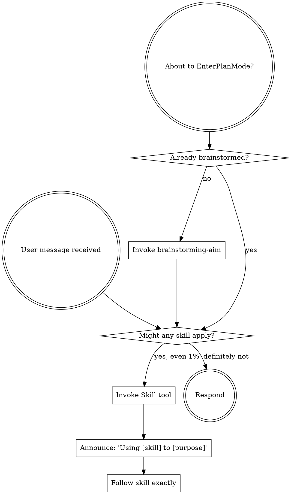

<SUBAGENT-STOP>
If you were dispatched as a subagent to execute a specific task, skip this skill.
</SUBAGENT-STOP>

<EXTREMELY-IMPORTANT>
If you think there is even a 1% chance a skill might apply to what you are doing, you ABSOLUTELY MUST invoke the skill.

IF A SKILL APPLIES TO YOUR TASK, YOU DO NOT HAVE A CHOICE. YOU MUST USE IT.

This is not negotiable. This is not optional. You cannot rationalize your way out of this.
</EXTREMELY-IMPORTANT>

## Instruction Priority

aim-harness skills override default system prompt behavior, but **user instructions always take precedence**:

1. **User's explicit instructions** (CLAUDE.md, AGENTS.md, direct requests) — highest priority
2. **aim-harness skills** — override default system behavior where they conflict
3. **Default system prompt** — lowest priority

## How to Access Skills

Use the `Skill` tool. When you invoke a skill, its content is loaded and presented to you—follow it directly. Never use the Read tool on skill files.

# Using Skills

## The Rule

**Invoke relevant or requested skills BEFORE any response or action.** Even a 1% chance a skill might apply means that you should invoke the skill to check. If an invoked skill turns out to be wrong for the situation, you don't need to use it.



## Skill Routing Table

| Trigger | Skill |
|---------|-------|
| IMS/Jira issue analysis, bug triage | **issue-analysis-aim** |
| New feature, fix, refactoring — design phase | **brainstorming-aim** |
| Spec exists, need task decomposition | **writing-plans-aim** |
| Plan exists, executing tasks sequentially | **executing-plans-aim** |
| Plan exists, executing with fresh subagents per task | **subagent-driven-development-aim** |
| Multiple independent problems, parallel dispatch | **dispatching-parallel-agents-aim** |
| Multiple independent subagents at once | **dispatching-parallel-agents-aim** |
| Implementing any function or fixing any bug | **test-driven-development-aim** |
| Test fails, runtime error, bug investigation | **systematic-debugging-aim** |
| Before claiming any task complete | **verification-before-completion-aim** |
| All tests pass, ready to push/MR | **finishing-a-development-branch-aim** |
| MR merged, need patch verification | **completing-patch-aim** |
| Need feature branch | **using-feature-branches-aim** |
| Self-review my code before MR | **requesting-code-review-aim** |
| Received review feedback | **receiving-code-review-aim** |
| Review someone else's MR | **code-reviewer-aim** |
| Writing documents (Jira, Confluence, IMS, GitLab, mail, md) | **writing-documents-aim** |
| Creating or editing a skill | **writing-skills-aim** |

## Workflow Chain

```
issue-analysis-aim (optional entry)
  └─→ brainstorming-aim
        └─→ writing-plans-aim
              └─→ executing-plans-aim / subagent-driven-development-aim
                    ├─→ [per task]
                    │     ├─→ test-driven-development-aim (TDD)
                    │     ├─→ systematic-debugging-aim (on failure)
                    │     └─→ verification-before-completion-aim (before done)
                    ├─→ [subagent-driven only: 2-stage review]
                    │     ├─→ spec-reviewer (spec compliance)
                    │     │     └─→ FAIL: respawn implementer
                    │     └─→ code-quality-reviewer (code quality)
                    │           └─→ FAIL: respawn implementer
                    └─→ finishing-a-development-branch-aim (all done)
                          ├─→ requesting-code-review-aim (self-review)
                          ├─→ receiving-code-review-aim (feedback)
                          └─→ [MR merged] → completing-patch-aim (패치 검증서)

Independent (direct invoke):
  issue-analysis-aim — issue analysis (chain entry or direct invoke)
  code-reviewer-aim — review others' MR (Phase A~I)
  dispatching-parallel-agents-aim — independent problem parallel debugging/investigation
  using-feature-branches-aim — branch management
  writing-documents-aim — document writing (cross-referenced by other skills)
  writing-skills-aim — skill authoring
```

## Red Flags

These thoughts mean STOP—you're rationalizing:

| Thought | Reality |
|---------|---------|
| "This is just a simple question" | Questions are tasks. Check for skills. |
| "I need more context first" | Skill check comes BEFORE clarifying questions. |
| "Let me explore the codebase first" | Skills tell you HOW to explore. Check first. |
| "I can check git/files quickly" | Files lack conversation context. Check for skills. |
| "This doesn't need a formal skill" | If a skill exists, use it. |
| "I remember this skill" | Skills evolve. Read current version. |
| "The skill is overkill" | Simple things become complex. Use it. |
| "I'll just do this one thing first" | Check BEFORE doing anything. |
| "I know what that means" | Knowing the concept != using the skill. Invoke it. |

## Skill Gap Reporting (자가 진화 의무)

**Purpose**: 스킬을 사용하면서 발견되는 결함/누락/오래된 정보를 사용자에게 **자발적으로** 보고한다. 이 메커니즘으로 스킬은 사용될수록 점점 완성된다.

**Trigger (이 중 하나라도 발견하면 보고 의무)**:
1. **규칙 vs 실제 불일치** — 스킬에 명시된 경로/명령/API/파일명이 실제 시스템과 다름
2. **새 합리화 발견** — 스킬의 Common Rationalizations 표에 없는 새 변명을 자신이 하고 있음을 자각 (verbatim 보고)
3. **새 함정 발견** — 스킬이 예측 못한 실패 패턴을 실제로 만남 (자신이 빠질 뻔한 경우 포함)
4. **사례 stale** — 스킬의 예시가 현재 코드/환경과 다름 (예: 토큰 경로, 커밋 SHA, 파일 경로)
5. **과도한 일반화/구체화** — 스킬 규칙이 현재 케이스에 맞지 않아 어색한 해석을 하게 됨
6. **미검증 시나리오** — 스킬의 Known Gaps 또는 새로 발견한 경계 케이스

**Format** (최종 응답 끝에 별도 블록으로):

```
[Skill Gap] <skill-name>
Finding: <무엇을 발견했는지, 1~2문장>
Evidence: <file:line, 명령 출력, 또는 실제 사례>
Proposal: <구체적 수정 제안 — 어느 섹션에 무엇을 추가/수정>
```

여러 gap이 있으면 여러 블록. 사용자가 수락/거절/보류 판단.

**When NOT to report**:
- 단순 선호 차이 ("나는 이 표현이 더 좋다") — 기준이 있는 개선만 보고
- 스킬이 의도적으로 다른 접근을 권장 (스킬 완독 부족이 원인)
- 이미 스킬에 있는 내용을 다시 제안 (read miss)

**Who decides**: gap 보고는 **에이전트 의무**. 개정 여부는 **사용자 권한**. 에이전트가 스스로 스킬을 수정하려 하지 말 것 (사용자 승인 없는 스킬 수정 금지).

### Rationalization Table

| 변명 | 현실 |
|------|------|
| "사소한 경로 오류라 보고 불필요" | 사소해도 보고. manual-guide의 access.md 경로 오류가 실제 스킬 수정을 불러왔다 |
| "이건 내 문제지 스킬 문제 아님" | 네가 틀린 합리화를 했다면 다른 에이전트도 마찬가지. 스킬이 차단해야 할 대상 |
| "사용자가 묻지 않았는데" | Skill Gap 보고는 명시적 지시 없이도 자동 의무 |
| "스킬 개정은 내 담당 아님" | **개정 아님, 보고가 의무**. 개정은 사용자 판단 |
| "이번만 예외로 처리하면 됨" | 예외는 곧 스킬의 허점. 보고 대상 |
| "워크어라운드로 해결했으니 OK" | 해결과 보고는 별개. 워크어라운드 자체가 gap의 증거 |
| "다음에 여유 있을 때 보고" | 지금 보고. 잊어버린다 |
| "스킬이 크게 안 틀렸으니" | 작은 오류도 쌓이면 스킬 신뢰도 붕괴 |

### Red Flags (gap 관련)

- 스킬 규칙과 실제가 다른데 **보고 없이 workaround로 진행** → 중단, gap 블록 작성
- 새 합리화를 스스로 했음을 인지했는데 **기록 없이 넘어감** → verbatim으로 보고
- 스킬의 파일 경로/명령을 시도했다가 실패했는데 **"환경 문제"로 치부** → gap 후보
- "사용자가 알아서 발견할 것" → 에이전트 책임 회피

### 예시

**Good**:
```
[Skill Gap] manual-guide
Finding: Step 2에 기재된 Jira 토큰 경로가 실제와 불일치
Evidence: /Users/mjkang/company/scripts/access.md 부재. 실제 경로는 /Users/mjkang/company/dev_sshfs/agent/info/access.md (= ../agent/info/access.md)
Proposal: Step 1, Step 2의 access.md 경로 2건을 ../agent/info/access.md로 수정. jira-guide.md와 일관성 확보
```

**Bad** (과도):
```
[Skill Gap] manual-guide
Finding: 8단계가 너무 많은 것 같음
(기준 없음, 의견)
```

## Skill Priority

When multiple skills could apply, use this order:

1. **Process skills first** (brainstorming-aim, systematic-debugging-aim) - these determine HOW to approach
2. **Implementation skills second** (test-driven-development-aim, executing-plans-aim) - these guide execution

"Build X" → brainstorming-aim first, then implementation skills.
"Fix this bug" → systematic-debugging-aim first, then domain-specific skills.

## Skill Types

**Rigid** (TDD, debugging, verification): Follow exactly. Don't adapt away discipline.

**Flexible** (brainstorming, patterns): Adapt principles to context.

The skill itself tells you which.

## AIM Common Rules (Quick Reference)

All work follows these rules (details in AGENTS.md/CLAUDE.md):

- **Shell**: All commands via `dx` (dev_exec.sh)
- **Git**: Feature branch only, never `rb_73`. Branch: `<keyword>_<IMS>_<Jira>`
- **Commit**: `<type> <Korean description>`. No `git add .`
- **Test**: `dx make gtest`, coverage 80% (`measure_diff_cov.sh`)
- **Build**: `dx make`
- **Artifacts**: `../agent/prompt/<topic>/` with prefixes (`review_`, `design_`, `plan_`, `exec_`, `debug_`, `verify_`, `finish_`, `analysis_`)
- **External**: GitLab MR (project 211, Mac curl), IMS (Chrome), Jira (Mac curl), NotebookLM

## User Instructions

Instructions say WHAT, not HOW. "Add X" or "Fix Y" doesn't mean skip workflows.
