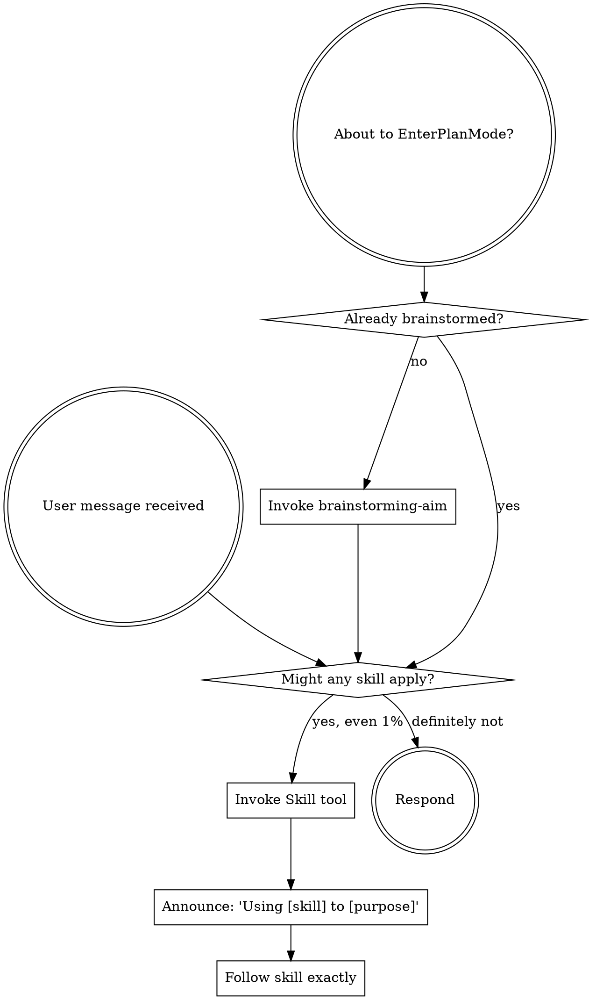

<SUBAGENT-STOP>
If you were dispatched as a subagent to execute a specific task, skip this skill.
</SUBAGENT-STOP>

<EXTREMELY-IMPORTANT>
If you think there is even a 1% chance a skill might apply to what you are doing, you ABSOLUTELY MUST invoke the skill.

IF A SKILL APPLIES TO YOUR TASK, YOU DO NOT HAVE A CHOICE. YOU MUST USE IT.

This is not negotiable. This is not optional. You cannot rationalize your way out of this.
</EXTREMELY-IMPORTANT>

## Instruction Priority

aim-harness skills override default system prompt behavior, but **user instructions always take precedence**:

1. **User's explicit instructions** (CLAUDE.md, AGENTS.md, direct requests) — highest priority
2. **aim-harness skills** — override default system behavior where they conflict
3. **Default system prompt** — lowest priority

## How to Access Skills

Use the `Skill` tool. When you invoke a skill, its content is loaded and presented to you—follow it directly. Never use the Read tool on skill files.

# Using Skills

## The Rule

**Invoke relevant or requested skills BEFORE any response or action.** Even a 1% chance a skill might apply means that you should invoke the skill to check. If an invoked skill turns out to be wrong for the situation, you don't need to use it.



## Skill Routing Table

| Trigger | Skill |
|---------|-------|
| IMS/Jira issue analysis, bug triage | **issue-analysis-aim** |
| New feature, fix, refactoring — design phase | **brainstorming-aim** |
| Spec exists, need task decomposition | **writing-plans-aim** |
| Plan exists, executing tasks sequentially | **executing-plans-aim** |
| Independent tasks, parallel dispatch | **subagent-driven-development-aim** |
| Multiple independent subagents at once | **dispatching-parallel-agents-aim** |
| Implementing any function or fixing any bug | **test-driven-development-aim** |
| Test fails, runtime error, bug investigation | **systematic-debugging-aim** |
| Before claiming any task complete | **verification-before-completion-aim** |
| All tests pass, ready to push/MR | **finishing-a-development-branch-aim** |
| MR merged, need patch verification | **completing-patch-aim** |
| Need feature branch | **using-feature-branches-aim** |
| Self-review my code before MR | **requesting-code-review-aim** |
| Received review feedback | **receiving-code-review-aim** |
| Review someone else's MR | **code-reviewer-aim** |
| Creating or editing a skill | **writing-skills-aim** |

## Workflow Chain

```
issue-analysis-aim (optional entry)
  └─→ brainstorming-aim
        └─→ writing-plans-aim
              └─→ executing-plans-aim / subagent-driven-development-aim
                    ├─→ test-driven-development-aim (each task)
                    ├─→ dispatching-parallel-agents-aim (parallel tasks)
                    ├─→ systematic-debugging-aim (on failure)
                    ├─→ verification-before-completion-aim (task done)
                    └─→ finishing-a-development-branch-aim (all done)
                          ├─→ requesting-code-review-aim (self-review)
                          ├─→ receiving-code-review-aim (feedback)
                          └─→ [MR merged] → completing-patch-aim (패치 검증서)

Independent:
  code-reviewer-aim — review others' MR (direct invoke)
  using-feature-branches-aim — branch management
  writing-skills-aim — skill authoring
```

## Red Flags

These thoughts mean STOP—you're rationalizing:

| Thought | Reality |
|---------|---------|
| "This is just a simple question" | Questions are tasks. Check for skills. |
| "I need more context first" | Skill check comes BEFORE clarifying questions. |
| "Let me explore the codebase first" | Skills tell you HOW to explore. Check first. |
| "I can check git/files quickly" | Files lack conversation context. Check for skills. |
| "This doesn't need a formal skill" | If a skill exists, use it. |
| "I remember this skill" | Skills evolve. Read current version. |
| "The skill is overkill" | Simple things become complex. Use it. |
| "I'll just do this one thing first" | Check BEFORE doing anything. |
| "I know what that means" | Knowing the concept != using the skill. Invoke it. |

## Skill Priority

When multiple skills could apply, use this order:

1. **Process skills first** (brainstorming-aim, systematic-debugging-aim) - these determine HOW to approach
2. **Implementation skills second** (test-driven-development-aim, executing-plans-aim) - these guide execution

"Build X" → brainstorming-aim first, then implementation skills.
"Fix this bug" → systematic-debugging-aim first, then domain-specific skills.

## Skill Types

**Rigid** (TDD, debugging, verification): Follow exactly. Don't adapt away discipline.

**Flexible** (brainstorming, patterns): Adapt principles to context.

The skill itself tells you which.

## AIM Common Rules (Quick Reference)

All work follows these rules (details in AGENTS.md/CLAUDE.md):

- **Shell**: All commands via `dx` (dev_exec.sh)
- **Git**: Feature branch only, never `rb_73`. Branch: `<keyword>_<IMS>_<Jira>`
- **Commit**: `<type>: <Korean description>`. No `git add .`
- **Test**: `dx make gtest`, coverage 80% (`measure_diff_cov.sh`)
- **Build**: `dx make`
- **Artifacts**: `../agent/prompt/<topic>/` with prefixes (`review_`, `design_`, `plan_`, `exec_`, `debug_`, `verify_`, `finish_`, `analysis_`)
- **External**: GitLab MR (project 211, Mac curl), IMS (Chrome), Jira (Mac curl), NotebookLM

## User Instructions

Instructions say WHAT, not HOW. "Add X" or "Fix Y" doesn't mean skip workflows.
